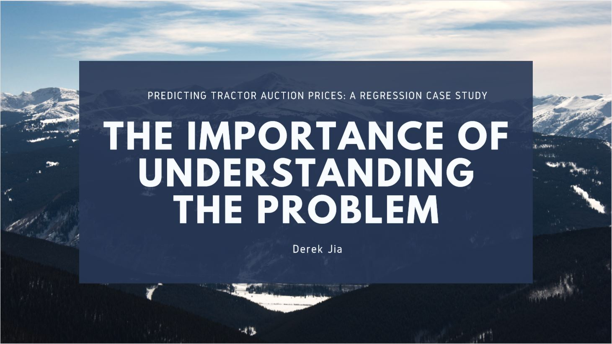
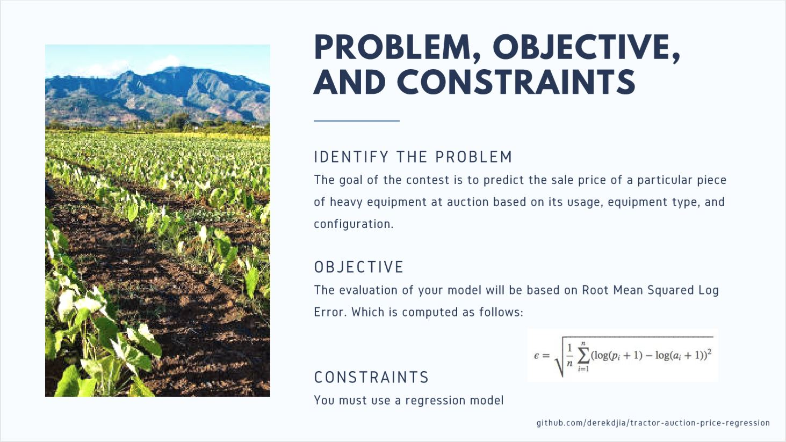
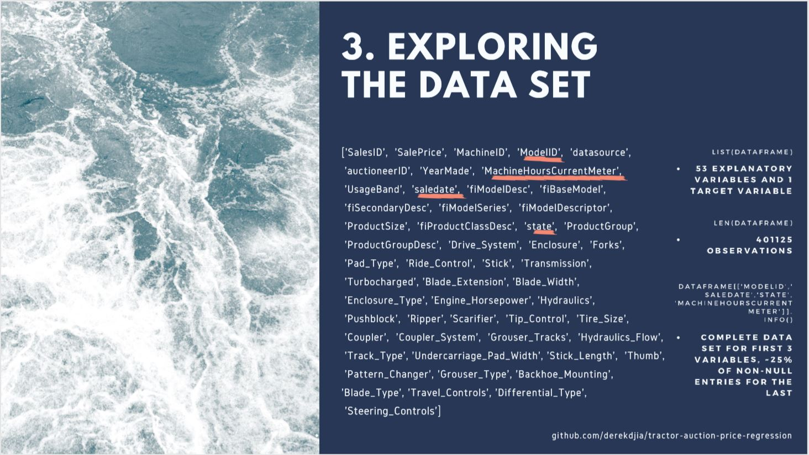
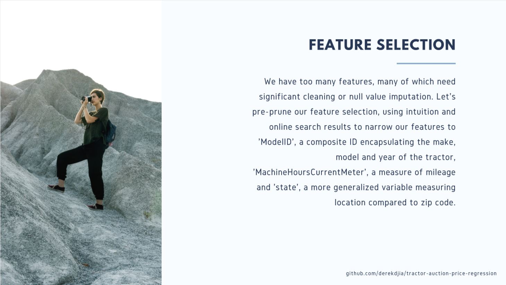
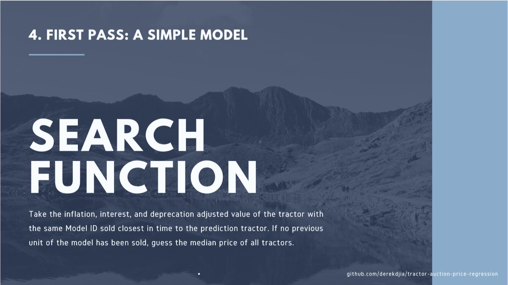

# A Simple Regression Case Study: Tractor Auction Pricing

A simple, fun case case study for new students of data. You are given a large dataset with 53 explanatory variables and 400,000 observations to create an accurate regression model. The repository showcases my cohort-best solution with a RMSLE of 0.275. 

Shoutouts to Elliot Saslow (https://github.com/Esaslow) for his help!

